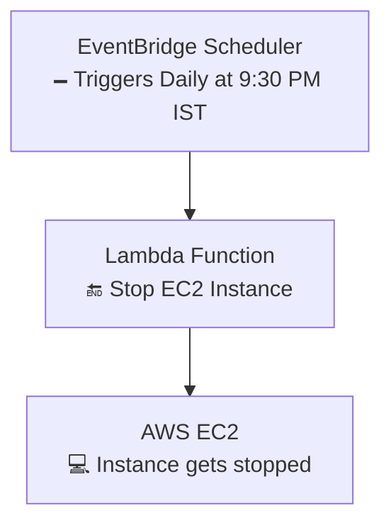

# 🪄 From Forgetfulness to Free Tier Savior 💥

There was a time… I’d forget to stop my EC2 instance 😩  
Next morning? Boom – AWS billed me like I owned a data center 💸  
**Free Tier gone. Budget ruined. Lesson learned.**

That’s when I said **ENOUGH IS ENOUGH!**  
I decided to automate my cloud like a boss 🤖☁️  
Now, my EC2 instance **shuts down automatically every night at 9:30 PM IST**.

No more surprises. No more regrets.  
Just clean, smart, serverless automation.  
I call it: **The Free Tier Saver.** 💻🕒

---

# 💸 Auto-Stop EC2 Instance Daily Using AWS Scheduler + Lambda 💡

A simple serverless project to:
✅ Automatically stop your EC2 instance every night  
✅ Save Free Tier hours & avoid unnecessary charges  
✅ Learn EventBridge Scheduler + Lambda + IAM Roles

---

## ⚙️ How It Works (Architecture)



---

## 🧠 Tech Used
- ✅ **Amazon EventBridge Scheduler** (cron-based trigger)
- ✅ **AWS Lambda** (Python script to stop EC2)
- ✅ **IAM Role** with EC2 Stop permissions
- ✅ **Asia/Calcutta timezone** for correct 9:30 PM execution

---

## 🗕️ Cron Expression Used

```bash
cron(30 21 * * ? *)
```

This means: **Every day at 21:30 (9:30 PM IST)**

---

## 💡 Why This Project is a Lifesaver

- 🙈 No more forgetting to stop EC2 manually  
- 🧠 Easy intro to serverless + automation  
- 💸 Stay within AWS Free Tier limits  
- ⏱️ Runs daily without you lifting a finger  
- 💥 Looks 🔥 on your SRE / DevOps / Cloud resume

---

## ✨ Future Plans
- Auto-stop EC2 **after 1 hour of inactivity** using CloudWatch + Lambda
- Add **Slack/Email notifications** after instance is stopped
- Open-source this as a reusable plug-n-play tool

---

## 🧑‍💻 Built with 💙 by [Suragouni Rahul Goud](https://github.com/rahulgit03)

Feel free to fork, star, or clone and save your Free Tier like a true cloud wizard 🧙‍♂️☁️✨

